# LearnUp
 

 #Project Idea! 

The project Idea is to connect teacher and learner in a simple way using the internet, and make it easier to deliver the homework or finding a good teacher also anyone can use it in their spare time to learn new things.
You can learn anything on this application not only an educational subject.
Anyone has it’s opportunity to learn or to teach in any field and his rate will help him to be better.
Every tutor will have his own room which he can handle the beginning and the ending of the room, he can make schedule to start the lesson.
Learner can post a question and others can answer it.
Teacher can post tasks and materials to the learners.
Every user can choose his interests so application can recommend rooms depending on his interests.

 
 

## 💻 Requirements

- Any Operating System (ie. MacOS X, Linux, Windows)
- Any IDE with Flutter SDK installed (ie. IntelliJ, Android Studio, VSCode etc)
- A little knowledge of Dart and Flutter

## ✨ Features

- [x] Login/Register
- [x] Add/delete Interests
- [x] Create Room
- [x] Create Meetiing
- [x] invite User to visit his room
- [x] User can accpet or reject invitation
- [x] Users send request to join in the Room
- [x] Admin of room can accpet or reject invitation
- [x] Add materials to rooms 
- [x] download material
- [x] make Report for Created rooms
- [x] make Report for each room
- [x] make Report for User
- [x] join to meeting live 
- [x] Ask question and reply 
- [x] Search by people, keywords,rooms or cateory 

## 📸 ScreenShots

<!--  -->

| Light                             | Dark                              |
| --------------------------------- | --------------------------------- |
| 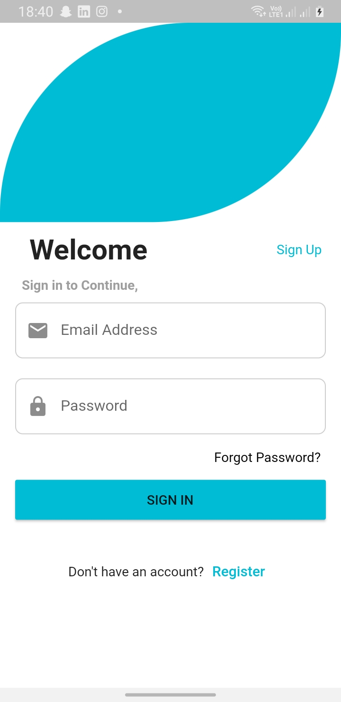  | 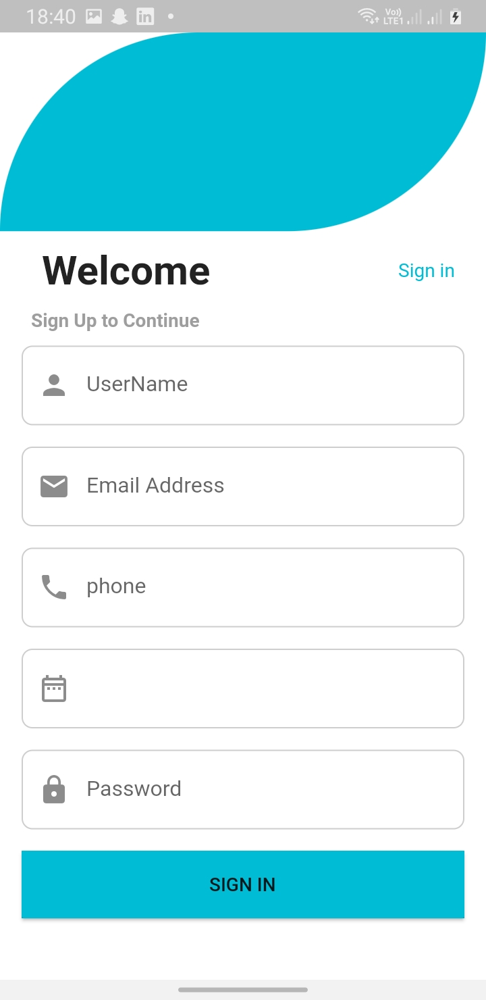  |
| 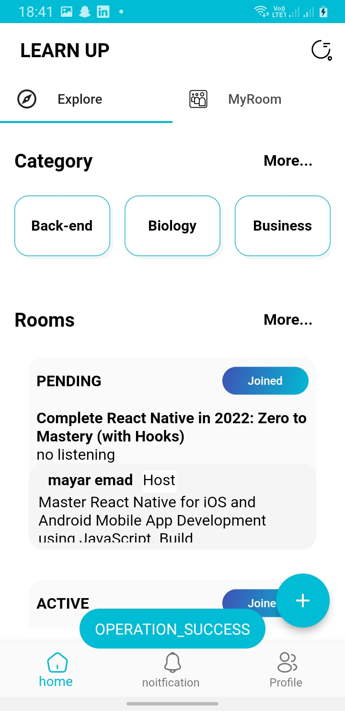  | 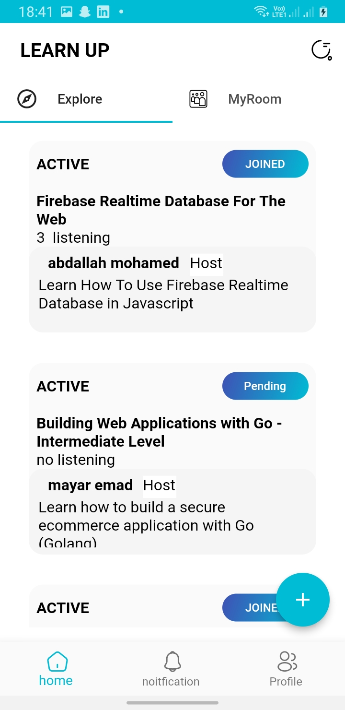  |
| 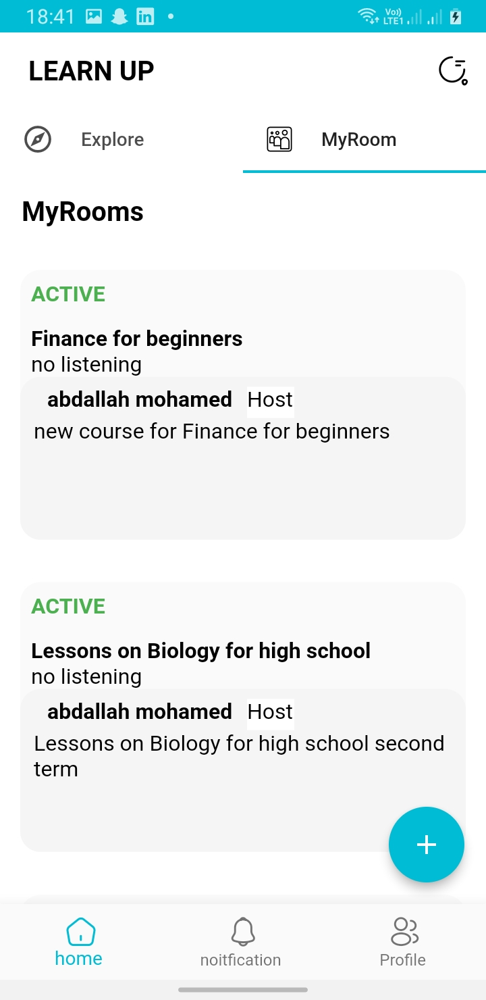  | 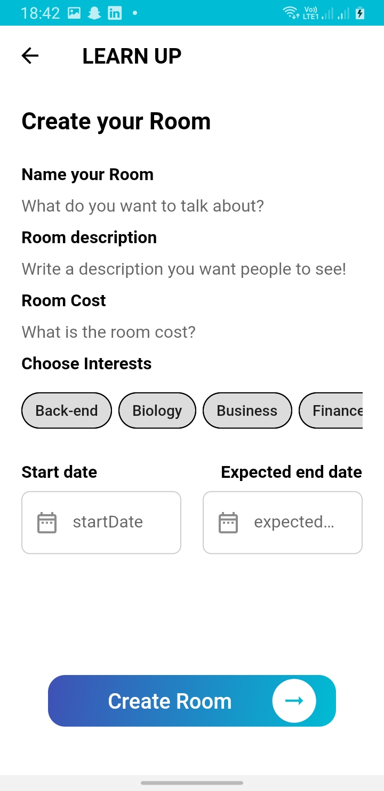  |
| 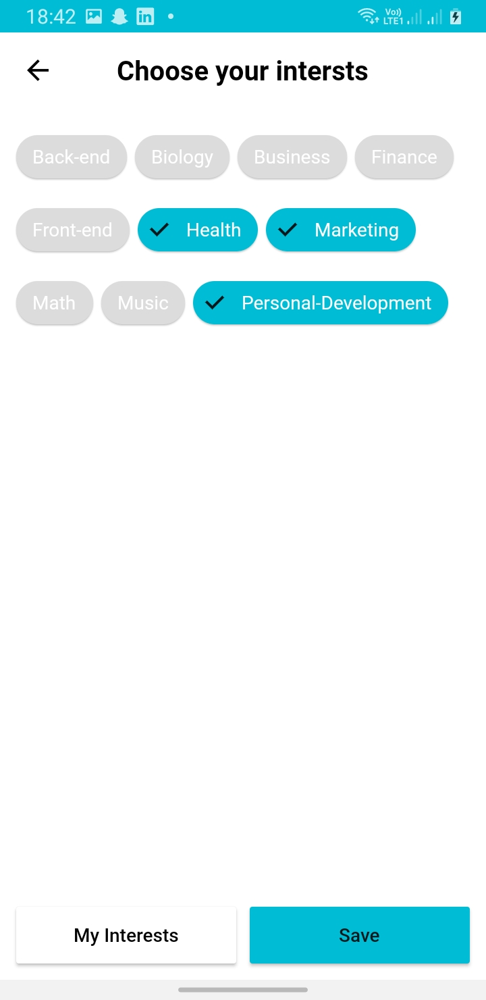  | 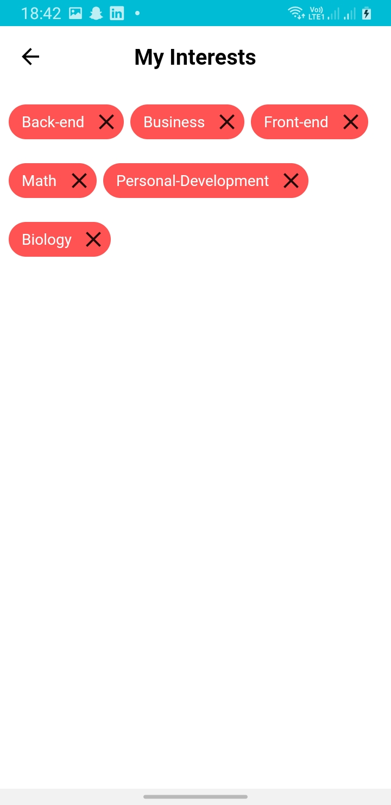  |
| 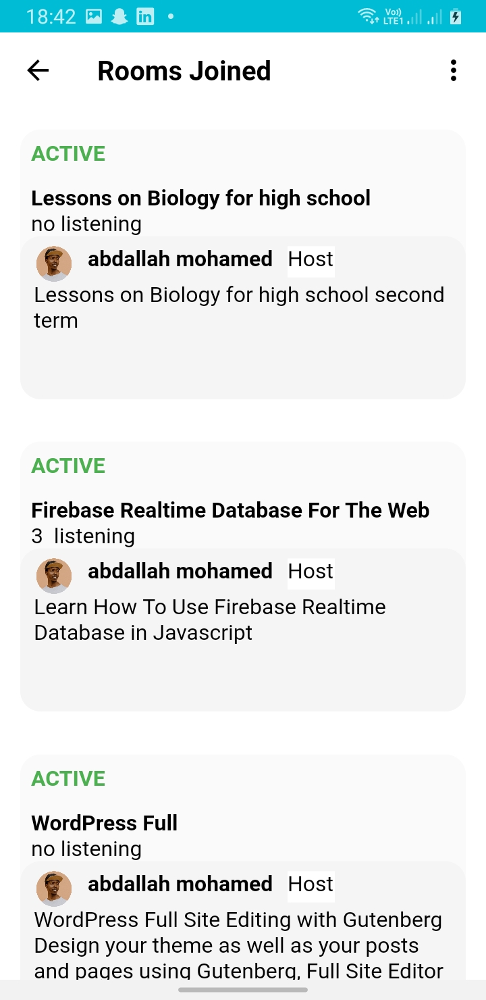  |  |
| 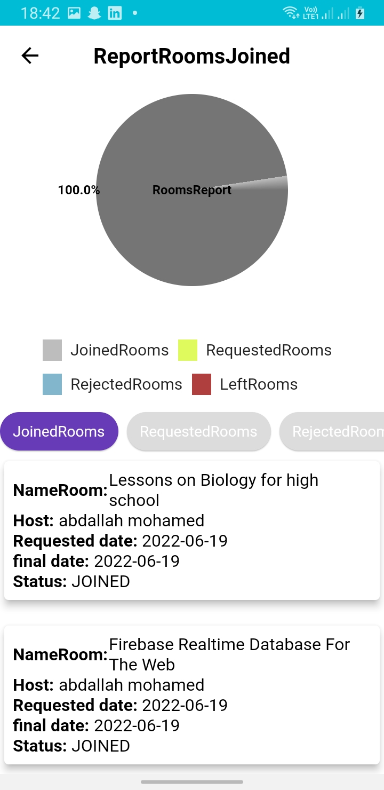 | 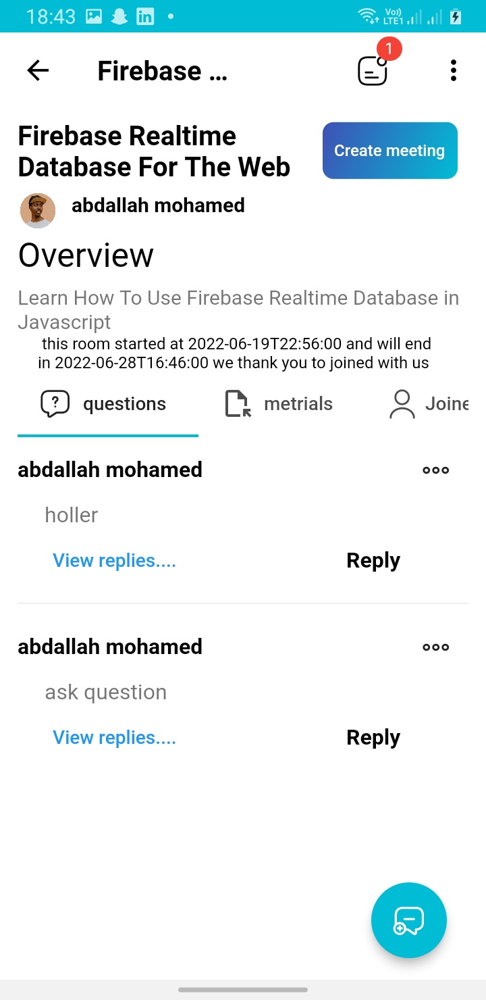 |
| 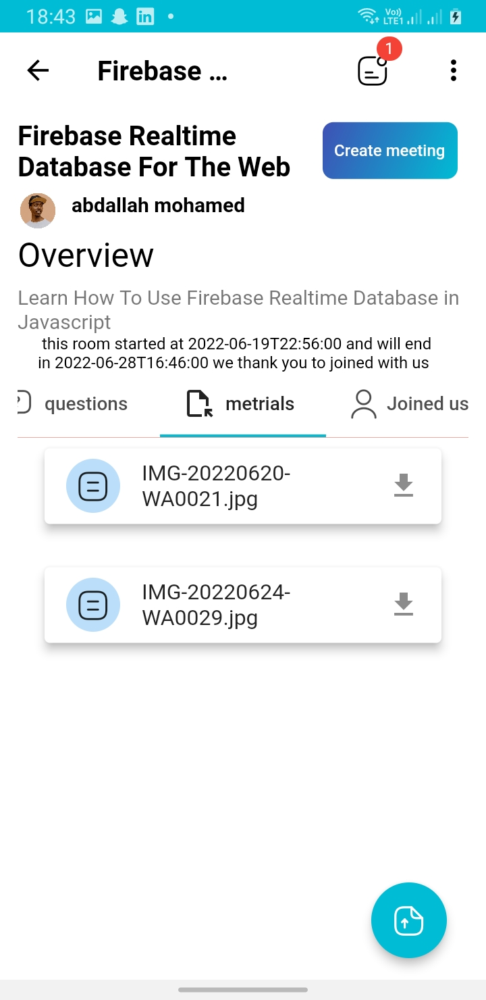 | 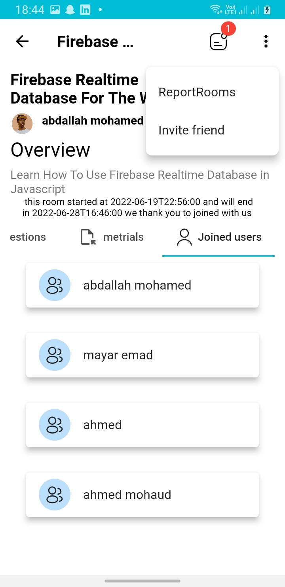 |
| 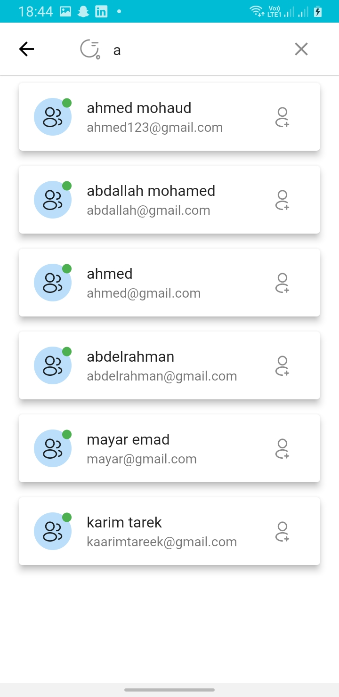 | 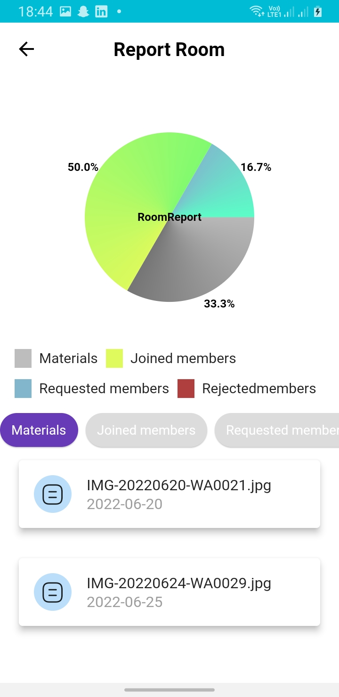 |
| 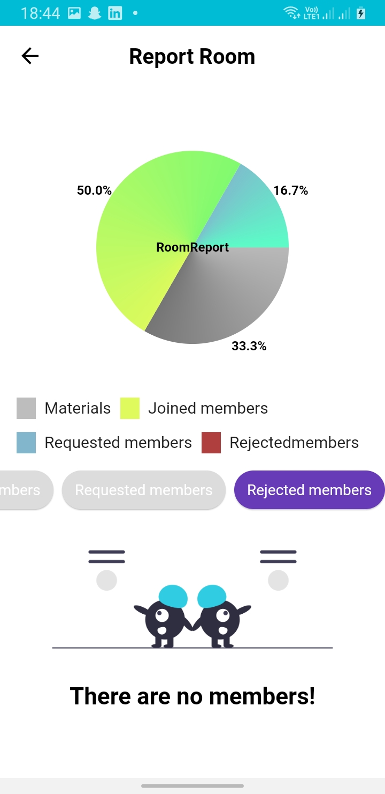 | 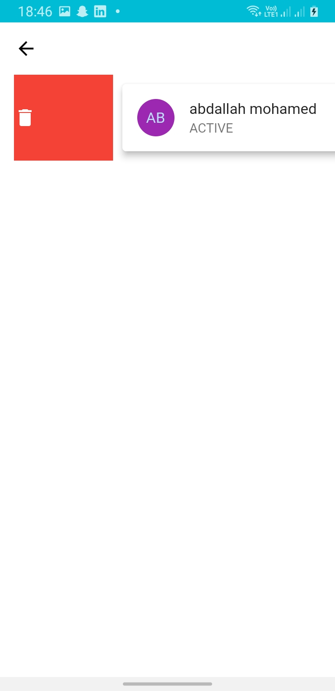 |
| 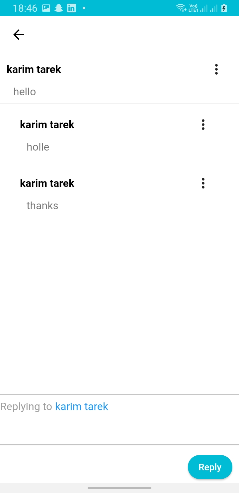 | 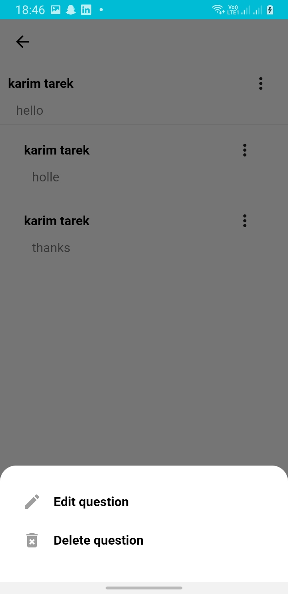 |
| 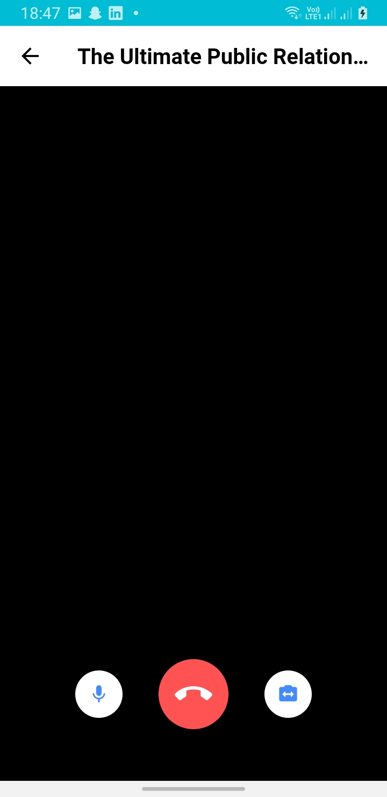 |  |

## 🔌 Plugins

| Name                                                    | Usage                                               |
| ------------------------------------------------------- | --------------------------------------------------- |
| [**Bloc**](https://pub.dev/packages/provider)       | State Management                                           |
| [**DIO**](https://pub.dev/packages/dio)                 | Network calls and File Download                     |
| [**agora_rtc_engine*](https://pub.dev/packages/agora_rtc_engine)                 | Vedio call and liveStreaming                     |
| [**Shared preferences**](https://pub.dev/packages/shared_preferences) |   |

 

## 🔖 LICENCE

 
